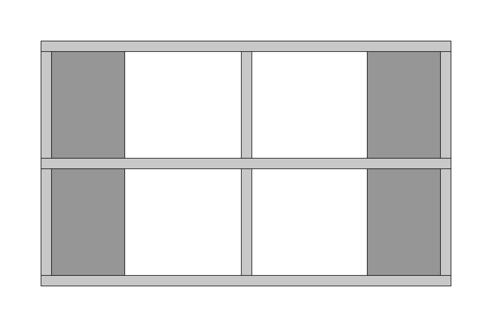
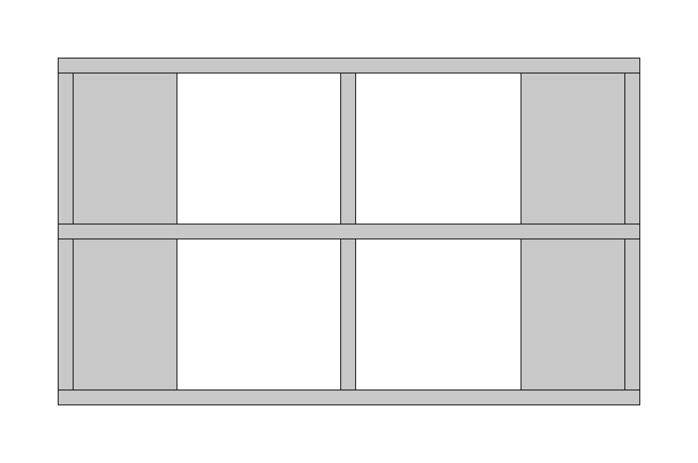

# furniture-renderer
Recruitment task - create a Django project with endpoint `/projection` accepting a list of geometries and plane to 
which they should be projected.

# Requirements

- Docker

# Installation

Build the image:
```shell
$ docker build --tag svg_renderer:latest .
```


Run the container:
```shell
$ docker run -p 8000:8000 svg_renderer:latest
```

# Assumptions / simplifications
I assumed that geometry described with a pair of two points (x1, y1, z1, x2, y2, z2) has each of its sides always parallel 
to one of XY, YZ, or XZ plane. With that assumption, I will render SVG on which only one side of given geometry may be 
visible.

# Additional features not required by specification

I was curious how the furniture will look from the back. To check that I decided to implement additional 
"reverse planes". 

This leads me to the conclusion that furniture like this from the example input, when cast to 2D would look exactly the 
same from both front and back because the same geometries are visible and are almost symmetric. 
I decided to use depth that could be easily calculated and use it to make the closer figures bright, and those which are 
from the back - darker. 

Front (XY plane)           |  Back (-XY plane)
:-------------------------:|:-------------------------:
  |  


When looking at the furniture from the top (XZ plane) - only one figure is visible, and the rest is obscured. 
Therefore there is no need to render each geometry from the input. I implemented a simple mechanism to remove figures 
fully obscured by another one. 

For described case app produces svg with single <rect /> object:: 

```xml
<?xml version="1.0" encoding="UTF-8"?>
<svg xmlns="http://www.w3.org/2000/svg" xmlns:xlink="http://www.w3.org/1999/xlink"
     width="1680" height="920" viewBox="0 -460 840 460">
<defs>
</defs>
<rect x="70" y="-390" width="700" height="320" fill="#c8c8c8" stroke="black" stroke-width="1" />
</svg>
```

I am aware of the case when figures could be fully obscured by multiple others, 
but those would be harder to implement in a hurry. The Idea might be to sort figures and stack them on each other, 
adding the collective area of them to the condition used to determine whenever further figures are obstructed.

To sum it up, additional features are:
- removing obscured geometries,
- shading of the geometry based on its depth,
- negated planes allowing to see the furniture from the other side.

# Example usage:

```shell
curl -XPOST -H "Content-type: application/json" -d '{
  "geometry": [{"x1": -207, "x2": -332, "y1": 9, "y2": 191, "z1": 0, "z2": 18}, {"x1": -207, "x2": -332, "y1": 209, "y2": 391, "z1": 0, "z2": 18}, {"x1": 207, "x2": 332, "y1": 9, "y2": 191, "z1": 0, "z2": 18}, {"x1": 207, "x2": 332, "y1": 209, "y2": 391, "z1": 0, "z2": 18}, {"x1": -8, "x2": 10, "y1": 9, "y2": 191, "z1": 0, "z2": 320}, {"x1": -8, "x2": 10, "y1": 209, "y2": 391, "z1": 0, "z2": 320}, {"x1": -350, "x2": -332, "y1": 9, "y2": 191, "z1": 0, "z2": 320}, {"x1": -350, "x2": -332, "y1": 209, "y2": 391, "z1": 0, "z2": 320}, {"x1": 332, "x2": 350, "y1": 9, "y2": 191, "z1": 0, "z2": 320}, {"x1": 332, "x2": 350, "y1": 209, "y2": 391, "z1": 0, "z2": 320}, {"x1": -350, "x2": 350, "y1": 391, "y2": 409, "z1": 0, "z2": 320}, {"x1": -350, "x2": 350, "y1": 191, "y2": 209, "z1": 0, "z2": 320}, {"x1": -350, "x2": 350, "y1": -9, "y2": 9, "z1": 0, "z2": 320}],
  "projection_plane": "XY"
}' 'http://localhost:8000/projection' > output.svg
```
Allowed "projection_plane" are: `XY`, `YZ`, `XZ`, `-XY`, `-YZ`, `-XZ`